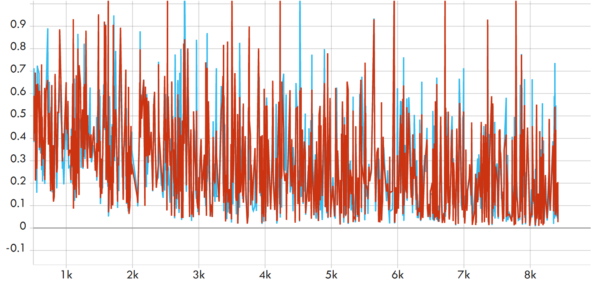
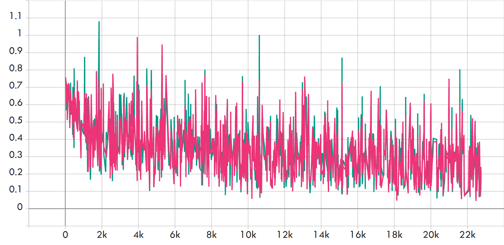

# STEP5-训练对齐
&emsp;&emsp;在本节中，我们期望对齐训练过程并最终完成复现。  
## 训练数据对齐
&emsp;&emsp;该部分见STEP2。

## 训练对齐
&emsp;&emsp;完成上述所有步骤后，我们期望对齐训练过程与结果，并最终完成复现。在训练对齐过程中，受到较多随机量的影响，精度有少量diff是正常的，diff在0.15%以内可以认为是正常的。  

## 一、SST2
&emsp;&emsp;本部分数据承载自 SST2（GLUE）。
```
cd STEP5-训练对齐/torch_train
python train_sst2.py
cd ../paddle_train & python train_sst2.py
```
&emsp;&emsp;相关参数：（单机单卡单精）
* LR = 2e-5
* batch_size = 8
* seed = 1234
* optimizer = AdamW
* LR-sheduler = Linear （Warmup Steps: 2000）
* epochs = 1

&emsp;&emsp;预训练模型取fnet-large，在SST2 validation数据集上有：
```
[2021/12/10 15:03:38] root INFO: acc: 
[2021/12/10 15:03:38] root INFO: 	mean diff: check passed: True, value: 0.0011467889908257645
[2021/12/10 15:03:38] root INFO: diff check passed
```

&emsp;&emsp;训练Loss如下：（红：PaddlePaddle  蓝：Pytorch）
<center></center>
&emsp;&emsp;可以发现二者Loss变化趋势接近且差异在可接受的范围内。

## 二、QQP
&emsp;&emsp;本部分数据承载自 QQP（GLUE）。

&emsp;&emsp;相关参数：（单机单卡单精）
* LR = 3e-5
* batch_size = 16
* seed = 1234
* optimizer = AdamW
* LR-sheduler = Linear （Warmup Steps: 3000）
* epochs = 1

&emsp;&emsp;预训练模型取fnet-large，在SST2 validation数据集上有：
```
[2021/12/12 12:48:47] root INFO: f1: 
[2021/12/12 12:48:47] root INFO: 	mean diff: check passed: True, value: 0.001161899850096404
[2021/12/12 12:48:47] root INFO: diff check passed
```

&emsp;&emsp;训练Loss如下：（粉红：PaddlePaddle  绿：Pytorch）
<center></center>

